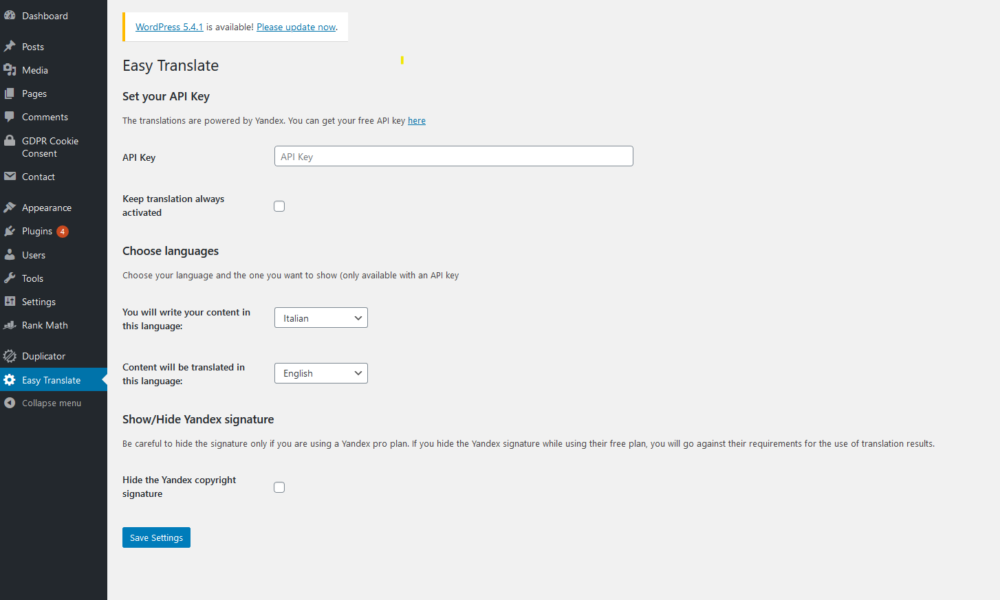
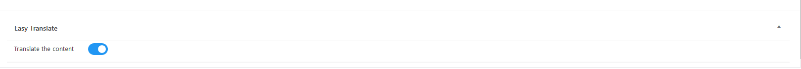

# Easy Translate WordPress Plugin
Easy translate allows you to write your content in your native language and to publish it in over 90 languages just pressing the publish button.

## How it works
The plugin works with the Yandex API.

Yandex has a **free plan** until **1.000.000** characters/day and **10.000.000** characters/month.

For a free-time blogger like me, is more than enough. If this limit is too tight for you, you can simply subscribe to their pro plan.

The plugin consists in a simple filter hook, `wp_insert_post_data`, that translates the post content, post title and post name (this means also the permalink) just before being saved into the database. This allow you to save your content already translated.

## Setting page
Once installed and activated, a new menu item "Easy Translate" will appear in your admin sidebar.
From there you can set the plugin.

1. You can get a free Yandex API [here](https://translate.yandex.com/developers/keys)
2. You can choose wether always keep the translation activated as default. If deactivated, you have to activate it every time if you want your content to be translated. You can do it activating the switch at the end of your post/page in the editor.
3. Choose your languages
4. Following the [Yandex requirements for the use of translation results](https://tech.yandex.com/translate/doc/dg/concepts/design-requirements-docpage/) a text is placed at the end of every translated post and page. If you have their pro plan, you can hide the text.

From now, every post and page you will write, will magically posted translated.

## THIS IS STILL A WORK IN PROGRESS
I am a solo developer, so be kind and please open issues or make PRs to fix bugs or write better code.

There is still a lot of work to do, if you would like to contribute:

### TO-DO
- [x] Add other languages in settings menu
- [x] Tranlsate also the permalink
- [x] Let the user choose if translate the post/page or not
- [ ] Add translation review before publish
- [ ] Add Google translate and Deepl API

### BUGS
- [ ] The filter is fired two times on publication
- [ ] Customizer can't save changes
- [ ] Can not manage media inside the post content
- [x] Can not manage links properly ("" added around url)
