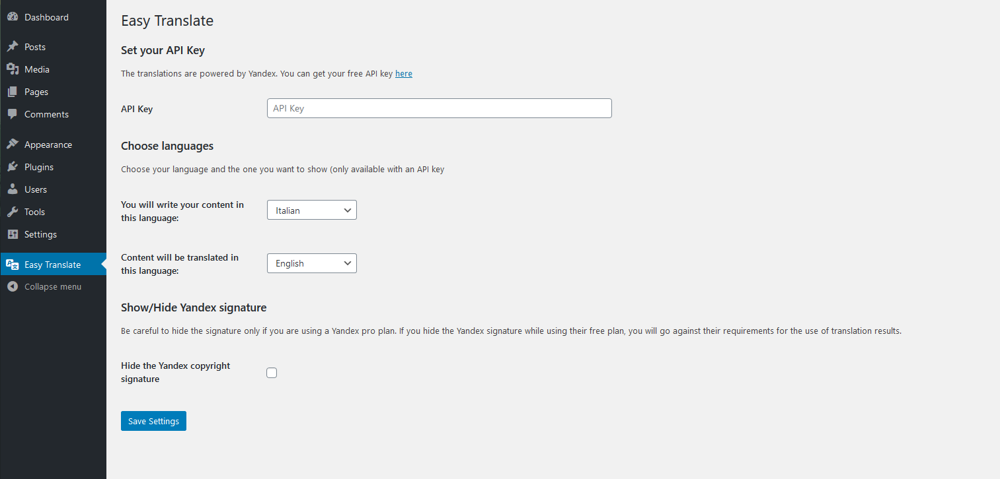
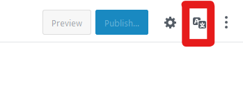
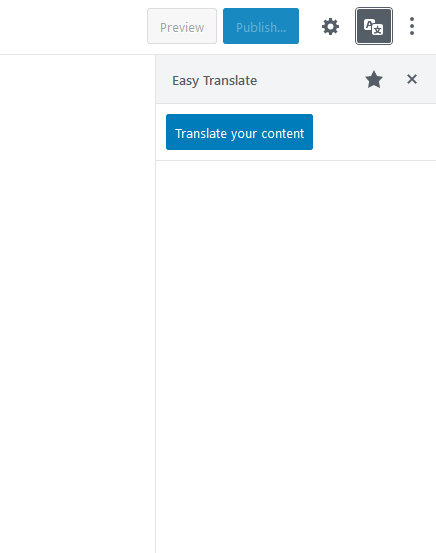
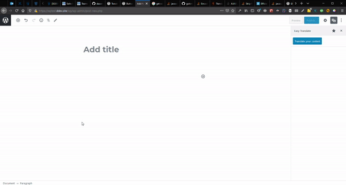

# Easy Translate WordPress Plugin
Easy translate allows you to write your content in your native language and to publish it in over 90 languages just pressing the publish button.

## How it works
The plugin works with the Yandex API.

Yandex has a **free plan** until **1.000.000** characters/day and **10.000.000** characters/month.

For a free-time blogger like me, is more than enough. If this limit is too tight for you, you can simply subscribe to their pro plan.

## Settings page
Once installed and activated, a new menu item "Easy Translate" will appear in your admin sidebar.
From there you can set the plugin.

1. You can get a free Yandex API [here](https://translate.yandex.com/developers/keys)
2. Choose your languages
3. Following the [Yandex requirements for the use of translation results](https://tech.yandex.com/translate/doc/dg/concepts/design-requirements-docpage/) a text is placed at the end of every translated post and page. If you have their pro plan, you can hide the text.

Now, in the editor you will see a new button next to "Publish":

It will open a sidebar with a button to translate the text:

This is the button for all the magic. Click it and your post will be translated directly inside the editor. In this way you can review the translation and fix the errors (if any) before publish it.

## Contributing
I am a solo developer, so please open issues or make PRs to fix bugs/improve code quality.

There is still a lot of work to do, any help is appreciated:

### TO-DO
- [ ] Add Google translate and Deepl API
